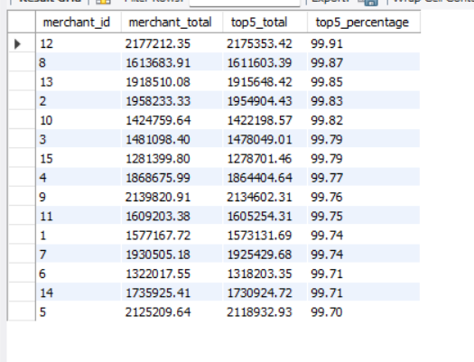

# 🚨 RedFlag – The Fraud Files
### Fraud Detection Engine Using Pure SQL

## 📌 Project Overview

RedFlag – The Fraud Files is an industry-oriented SQL project that simulates the work of a Fraud Analyst at a fintech payment aggregator. Using a dataset of approximately 200,000 transactions over six months, this project detects multiple real-world financial fraud patterns using only SQL. No Python, Machine Learning, or external tools were used—only MySQL queries, aggregate functions, Common Table Expressions (CTEs), and Window Functions.

---

## 🎯 Objective

The objective of this project is to identify suspicious users, merchants, and transactions by implementing SQL-based fraud detection techniques commonly used by fintech companies such as Razorpay, PhonePe, Cred, Slice, and Paytm.

---

## 📊 Dataset

- **Dataset Size:** ~200,000 transactions
- **Duration:** January 2024 – June 2024
- **Database:** MySQL
- **Table:** `transactions`

---

## 🛠️ Tech Stack

- MySQL
- SQL
- MySQL Workbench

---

## 🔍 Fraud Patterns Detected

### Tier 1
- Velocity Fraud
- Round-Amount Clustering
- Card Testing
- Failed Transaction Pattern
- Odd-Hour Concentration

### Tier 2
- Mule Accounts
- Refund Abuse
- Merchant Collusion
- Just-Under-Threshold (Structuring)
- Dormant-Then-Active

### Tier 3
- Velocity Spike
- Geographic Impossibility

---

## 📈 SQL Concepts Used

- SELECT
- WHERE
- GROUP BY
- HAVING
- ORDER BY
- CASE WHEN
- Aggregate Functions
- Common Table Expressions (CTEs)
- Window Functions
  - LAG()
  - ROW_NUMBER()
- DATE()
- DATE_FORMAT()
- HOUR()
- TIMESTAMPDIFF()

---

## 📷 Sample Output



## ▶️ How to Run

1. Install MySQL Server and MySQL Workbench.
2. Import the provided transaction dataset.
3. Execute the SQL script:
   ```
   RedFlag_SamarpanPandit.sql
   ```
4. Review the output of each fraud detection pattern.

---

## 📚 Learning Outcomes

Through this project, I learned how to:

- Detect fraud using SQL
- Analyze large transaction datasets
- Build complex SQL queries
- Use Window Functions
- Write multi-step CTE queries
- Perform financial transaction analysis
- Solve real-world business problems using SQL

---

## 👨‍💻 Author

**Samarpan Pandit**

B.Tech CSE Student

---

## ⭐ Acknowledgement

This project was completed as part of the **RedFlag – The Fraud Files** SQL Minor Project, designed to simulate real-world fintech fraud detection using SQL.
